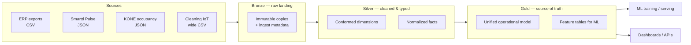

# Data Pipeline Plan — Standardize, Clean, and Unify Customer Data for ML

This document describes the steps needed to build a data pipeline that standardizes and cleans data from all customers into a single source of truth, enabling machine learning solutions.

---

## The Problem in Your Data Today

Your sources fall into four families with different schemas and grain:

| Source | Format | Grain | Shared keys |
|--------|--------|-------|-------------|
| Work orders, alarms, maintenance plans | CSV (ERP) | Event / row | `CUSTOMER_NO`, `CUSTOMER_SITE_NO`, `PM_NO`, `WO_NO` |
| Smartti Pulse | Nested JSON | Hourly readings + incidents | Property/node IDs (different namespace) |
| KONE occupancy | JSON arrays | Floor × weekday × hour profile | Building name only |
| Room/desk utilization | Wide CSV | Asset × day | Room names, no ERP link |

Additional friction you must plan for:

- **Site coverage is uneven** — Valmet sites have work orders; anonymous sites have Smartti/KONE but no ERP data.
- **Same concept, different shape** — alarms exist in both `alarms.csv` and Smartti `incidents`.
- **Known quality issues** — literal `"NULL"` strings, UTF-8 BOM, duplicate maintenance plan rows, Finnish free text, mixed time zones (UTC in Smartti vs local datetimes in ERP).

A pipeline's job is not to force everything into one table. It is to produce **one canonical model** with **consistent keys, types, and semantics** that ML can consume.

---

## Target Architecture (Medallion / Lakehouse)



---

## Step-by-Step Pipeline Plan

### Phase 1 — Inventory and Contracts (Before Any Code)

**Goal:** Define what "standard" means.

1. **Catalog every source** — system, owner, refresh cadence, PII/anonymization rules, spec doc (you already have good ones for alarms, work orders, maintenance).
2. **Define a canonical domain model** — at minimum:
   - **Dimensions:** `customer`, `site`, `building`, `floor`, `room/asset`, `contract`, `equipment/node`, `service_line`
   - **Facts:** `work_order`, `alarm_event`, `maintenance_plan`, `sensor_reading`, `occupancy_reading`, `utilization_daily`, `incident`
3. **Write data contracts per source** — expected columns, types, null rules, primary keys, allowed enum values.
4. **Design the master location graph** — this is the hardest part. ERP uses `CUSTOMER_SITE_NO` + `LOCATION_ID`; Smartti uses `property.id` + `node.id`; KONE uses `floor` labels; cleaning uses room names like `Letto`, `K2`. You need a **mapping table** (manual at first, ML-assisted later).

Example mapping:

| canonical_site_id | erp_customer_site_no | smartti_property_id | kone_building | notes |
|-------------------|----------------------|---------------------|---------------|-------|
| site_valmet_l11 | 998389833 | — | — | Tampere |
| site_aurora | — | aurora_house | Aurora House | anonymized |

---

### Phase 2 — Ingestion (Bronze Layer)

**Goal:** Land data unchanged, reproducibly, with lineage.

1. **Connectors per source**
   - Batch file drops (CSV/JSON exports) — what you have now
   - Later: API pulls (Smartti Pulse, KONE Occupancy API), ERP DB/API, IoT streams
2. **Store raw as-is** — Parquet or Delta/Iceberg on object storage (S3/GCS/Azure), partitioned by `source_system / ingest_date`.
3. **Attach metadata** — `ingested_at`, `source_file`, `schema_version`, `customer_id`, `export_date`.
4. **Never mutate Bronze** — all cleaning happens downstream.

For the hackathon, even a folder structure like `bronze/{source}/{date}/` is enough to prove the pattern.

---

### Phase 3 — Standardization and Cleaning (Silver Layer)

**Goal:** Typed, deduplicated, conformed tables.

Apply the same rules to every source:

| Rule | Your data example |
|------|-------------------|
| Parse types | Datetimes, booleans (`True`/`False`/`0`/`1`), integers |
| Normalize nulls | Map `"NULL"`, `""`, `"null"` → SQL `NULL` |
| Strip BOM | UTF-8 BOM on ERP CSVs |
| Time zones | Convert everything to UTC; store `site_timezone` for local display |
| Deduplicate | Maintenance plans: dedupe on `PM_NO` |
| Unpivot wide tables | Room/desk utilization: asset × date → `(asset, date, utilization_pct)` |
| Explode nested JSON | Smartti `readings.electricity_kWh.data[]` → `(timestamp, metric, value, meter_key, source)` |
| Flatten KONE profiles | `(building, floor, month, weekday, hour, occupancy)` |
| Language handling | Keep Finnish text; add optional `description_en` via translation batch job |
| Anonymization | Preserve `[NAME]`/`[PHONE]`/`[EMAIL]` tokens; block re-identification in Gold exports |

**Silver outputs (one per domain entity):**

```
silver.dim_customer
silver.dim_site
silver.dim_asset          -- rooms, desks, floors, devices
silver.dim_equipment      -- HWID, Smartti nodes, robots
silver.fact_work_order
silver.fact_alarm
silver.fact_maintenance_plan
silver.fact_sensor_reading
silver.fact_occupancy
silver.fact_utilization
silver.fact_incident        -- Smartti incidents + ERP-derived events
```

---

### Phase 4 — Conformed Dimensions (The "Glue")

**Goal:** One ID space across customers.

1. **`dim_site`** — canonical site with address, customer, property codes from README.
2. **`dim_asset_hierarchy`** — site → building → floor → room/desk/equipment.
3. **`bridge_source_asset_map`** — maps external IDs to canonical IDs with confidence and effective dates.
4. **`dim_contract`** — contract type (`SP`, `KH`, `KT`, `KIPA`) aligned across work orders and alarms.

Without this layer, cross-source joins fail even when data is clean.

Known join paths in your ERP data:

- Work orders ↔ Maintenance plans: `PM_NO`
- Alarms ↔ Work orders: `WORKORDER_NO` ↔ `WO_NO`
- All ERP tables: `CUSTOMER_NO` + `CUSTOMER_SITE_NO` + `CUSTOMER_WORKSITE_NO`

Smartti and KONE need explicit mapping into the same `site_id`.

---

### Phase 5 — Gold Layer (Single Source of Truth)

**Goal:** Business-ready, ML-ready tables with stable semantics.

Build **subject-area marts** plus **cross-domain views**:

**Operational reliability view** (good for predictive maintenance):

```sql
-- Conceptual: one row per site × day with unified signals
site_daily_signals (
  site_id, date,
  alarm_count, fire_alarm_count, hvac_alarm_count,
  open_work_orders, sla_violations,
  avg_co2_ppm, avg_indoor_temp_c,
  electricity_kwh, heating_mwh,
  avg_room_utilization_pct, avg_desk_utilization_pct,
  avg_elevator_occupancy,
  incident_count, unresolved_incident_count
)
```

**Event timeline view** — union of alarms, work orders (created/closed), Smartti incidents, with `event_type`, `severity`, `asset_id`, `timestamp_utc`.

**Asset health view** — roll up alarm frequency, repeat work orders, sensor drift per equipment/node.

Gold should be:

- **Idempotent** — reruns produce the same result
- **Versioned** — `as_of_date` or snapshot partitions for ML reproducibility
- **Documented** — column definitions, grain, refresh SLA

---

### Phase 6 — Data Quality and Governance

Automated checks at Silver/Gold boundaries:

| Check | Example |
|-------|---------|
| Schema drift | New column in ERP export → alert |
| Freshness | No Smartti data in 24h → alert |
| Referential integrity | `% alarms with valid site_id` > 99% |
| Uniqueness | `ALERT_EVENT_ID` unique |
| Range / enum | Priority in {1, 50, 60, 77, 99} |
| Cross-source consistency | Alarm count ERP vs Smartti within tolerance |
| PII scan | No raw emails/names in Gold |

Tools: Great Expectations, dbt tests, or custom validators in your orchestrator.

---

### Phase 7 — Orchestration and Tooling

**Recommended stack (pick one path):**

| Layer | Lightweight (hackathon) | Production |
|-------|-------------------------|------------|
| Orchestration | Prefect / Airflow | Airflow / Dagster |
| Transform | Python (pandas/Polars) + dbt | dbt + Spark |
| Storage | Parquet on disk / MinIO | Delta Lake / Iceberg on cloud |
| Warehouse | DuckDB / ClickHouse | BigQuery / Snowflake / ClickHouse |
| Feature store | Parquet feature tables | Feast / Tecton |
| ML | scikit-learn / XGBoost | MLflow + scheduled retraining |

Pipeline DAG sketch:

```
ingest_erp → clean_erp → dim_site, fact_work_order, fact_alarm
ingest_smartti → explode_readings → fact_sensor_reading, fact_incident
ingest_kone → flatten_occupancy → fact_occupancy
ingest_utilization → unpivot → fact_utilization
build_asset_map (manual + rules)
build_gold_site_daily_signals
run_quality_checks
export_ml_features
```

---

### Phase 8 — ML-Ready Feature Layer

**Goal:** Separate training features from raw truth.

1. **Define prediction problems first** — e.g. SLA violation, alarm → work order, equipment failure within 7 days, cleaning need score.
2. **Choose feature grain** — usually `site × day`, `asset × week`, or `work_order` at creation time.
3. **Build point-in-time features** — only use data available before the prediction moment (avoid leakage).
4. **Create labels from Gold** — e.g. `IS_SLA_VIOLATION`, repeat alarm within 30 days, work order reopened.
5. **Store in a feature store** with `entity_id`, `event_timestamp`, `feature_values`, `feature_version`.

Example features for work-order SLA prediction:

- Rolling 7/30-day alarm counts by site and alert type
- Open work order backlog
- Average indoor CO₂ and temperature deviation
- Room utilization trend
- Days since last maintenance for same `PM_NO`
- Contract type, service line, priority

---

## Suggested Implementation Order

For a hackathon or MVP, prioritize in this sequence:

1. **ERP Silver tables** — work orders + alarms + maintenance (shared keys, biggest ROI)
2. **Site dimension + mapping** — even partial mapping unlocks cross-source joins
3. **Smartti reading explosion** — time-series for energy/climate ML
4. **Gold `site_daily_signals`** — one table that powers dashboards and models
5. **Utilization + KONE** — add usage/load signals for cleaning and occupancy use cases
6. **Quality checks + documentation** — makes it production-credible

---

## What "Source of Truth" Means Here

It does not mean one giant table. It means:

- **One canonical ID** for customer, site, asset
- **One definition** per metric (e.g. "alarm" = ERP row or Smartti incident with mapped severity)
- **One timeline** of operational events
- **One feature layer** versioned for ML
- **One governance model** for PII, refresh, and ownership

---

## ML Use Cases Unlocked by This Pipeline

Once Gold exists, you can credibly build:

| Use case | Primary inputs |
|----------|----------------|
| Predict SLA violations | Work order history + site load + open backlog |
| Alarm → work order likelihood | Alarms + past linkage rate + asset history |
| Dynamic maintenance scheduling | Maintenance plans + sensor drift + alarm frequency |
| Need-based cleaning | Room/desk utilization + occupancy + work orders |
| Early failure detection | Smartti incidents + HVAC alarms + energy anomalies |
| Operational reliability KPI | Unified daily signals per site |

---

## Practical Next Step

The highest-value 2-day build is:

1. A **`pipeline/`** Python package with Bronze ingest + Silver transforms for ERP CSVs
2. A **`mappings/sites.yaml`** linking Valmet ERP sites to property IDs
3. A **`gold/site_daily_signals.parquet`** joining alarms + work orders + (where available) utilization
4. A **dbt-style schema.yml** or data spec documenting Gold columns

That gives you a demonstrable **data → signals** path for the jury, with a clear story for how it scales to all customers.
